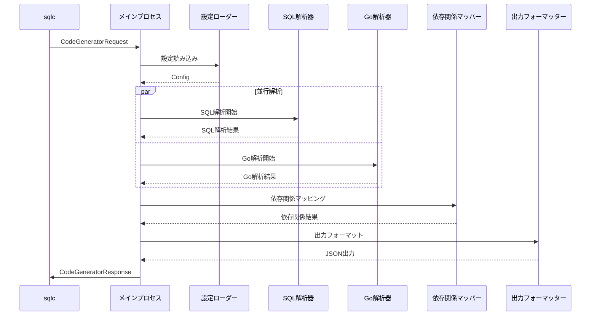

# sqlc依存関係解析プラグイン 統合設計書

## 1. 概要

本書は、sqlc依存関係解析プラグインの統合設計書です。各モジュールの設計を統合し、システム全体の一貫性と効率性を確保します。

## 2. システム全体図

```
┌─────────────────────────────────────────────────────────────────────┐
│                        sqlc generate                                │
└─────────────────────────┬───────────────────────────────────────────┘
                          │ CodeGeneratorRequest (JSON)
                          ▼
┌─────────────────────────────────────────────────────────────────────┐
│                   プラグインメインプロセス                           │
│                                                                     │
│  ┌─────────────────┐  ┌─────────────────┐  ┌─────────────────┐    │
│  │ 設定ローダー    │  │ エラーコレクター │  │ 進捗レポーター   │    │
│  └─────────────────┘  └─────────────────┘  └─────────────────┘    │
│                                                                     │
│  ┌─────────────────────────────────────────────────────────────┐   │
│  │                解析オーケストレーター                        │   │
│  │  ┌─────────────┐  ┌─────────────┐  ┌─────────────────┐    │   │
│  │  │ SQL解析器   │  │ Go解析器    │  │ 依存関係マッパー │    │   │
│  │  └─────────────┘  └─────────────┘  └─────────────────┘    │   │
│  └─────────────────────────────────────────────────────────────┘   │
│                                                                     │
│  ┌─────────────────────────────────────────────────────────────┐   │
│  │                    出力フォーマッター                        │   │
│  │  ┌─────────────┐  ┌─────────────┐  ┌─────────────────┐    │   │
│  │  │ JSON出力    │  │ CSV出力     │  │ エラーレポート   │    │   │
│  │  └─────────────┘  └─────────────┘  └─────────────────┘    │   │
│  └─────────────────────────────────────────────────────────────┘   │
└─────────────────────────────────────────────────────────────────────┘
                          │
                          ▼
                  JSON出力ファイル
```

## 3. 実装戦略

### 3.1. 開発フェーズ

#### フェーズ1: 基盤実装
- [ ] プラグインのスケルトン実装
- [ ] 設定管理システム
- [ ] エラーハンドリング基盤
- [ ] 基本的な入出力処理

#### フェーズ2: 解析エンジン
- [ ] SQL解析モジュール
- [ ] Go静的解析モジュール
- [ ] 基本的な依存関係マッピング

#### フェーズ3: 高度な機能
- [ ] 推移的依存関係の解決
- [ ] 複雑なSQL構文への対応
- [ ] パフォーマンス最適化

#### フェーズ4: 品質向上
- [ ] 包括的テストの実装
- [ ] エラーハンドリングの改善
- [ ] ユーザビリティの向上

### 3.2. ディレクトリ構造

```
.
├── cmd/
│   └── analyzer/
│       └── main.go                 # エントリーポイント
├── internal/
│   ├── analyzer/
│   │   ├── sql/                   # SQL解析モジュール
│   │   │   ├── parser.go
│   │   │   ├── extractor.go
│   │   │   └── analyzer.go
│   │   ├── go/                    # Go解析モジュール
│   │   │   ├── collector.go
│   │   │   ├── loader.go
│   │   │   ├── ast_analyzer.go
│   │   │   └── call_analyzer.go
│   │   └── mapper/                # 依存関係マッピング
│   │       ├── dependency_mapper.go
│   │       ├── graph.go
│   │       └── resolver.go
│   ├── config/
│   │   ├── config.go
│   │   ├── loader.go
│   │   └── validator.go
│   ├── errors/
│   │   ├── types.go
│   │   ├── collector.go
│   │   └── reporter.go
│   ├── io/
│   │   ├── input.go
│   │   ├── output.go
│   │   └── formatter.go
│   └── orchestrator/
│       ├── orchestrator.go
│       └── pipeline.go
├── pkg/
│   └── types/                     # 共通型定義
│       ├── analysis.go
│       ├── dependency.go
│       └── config.go
├── docs/                          # 設計書
├── test/
│   ├── fixtures/                  # テスト用データ
│   ├── integration/               # 統合テスト
│   └── unit/                      # ユニットテスト
├── examples/                      # 使用例
├── go.mod
├── go.sum
└── README.md
```

## 4. データフロー

### 4.1. 処理シーケンス



### 4.2. データ変換フロー

```
CodeGeneratorRequest
    │
    ├── Queries[] ──────────────── SQL解析 ──────────────── SQLMethodInfo[]
    │                                                          │
    └── Settings ────────────────── 設定読み込み ────────────── Config
                                      │                        │
                                      ▼                        │
                                 Go解析 ──────────────── GoFunctionInfo[]
                                      │                        │
                                      └────────────────────────┘
                                                               │
                                                               ▼
                                                    依存関係マッピング
                                                               │
                                                               ▼
                                                    DependencyResult
                                                               │
                                                               ▼
                                                       JSONフォーマット
                                                               │
                                                               ▼
                                                         出力ファイル
```

## 5. 並行処理設計

### 5.1. 並行処理ポイント

```go
func (o *Orchestrator) Execute(request *CodeGeneratorRequest) (*DependencyResult, error) {
    // 1. 設定の読み込み（同期）
    config, err := o.loadConfig(request)
    if err != nil {
        return nil, err
    }
    
    // 2. 解析の並行実行
    var wg sync.WaitGroup
    var sqlResult map[string]SQLMethodInfo
    var goResult map[string]*GoFunctionInfo
    var sqlErr, goErr error
    
    // SQL解析（並行）
    wg.Add(1)
    go func() {
        defer wg.Done()
        sqlResult, sqlErr = o.sqlAnalyzer.Analyze(request.Queries)
    }()
    
    // Go解析（並行）
    wg.Add(1)
    go func() {
        defer wg.Done()
        goResult, goErr = o.goAnalyzer.Analyze(config.RootPath, config.Analysis)
    }()
    
    wg.Wait()
    
    // エラーチェック
    if sqlErr != nil || goErr != nil {
        return nil, errors.Join(sqlErr, goErr)
    }
    
    // 3. 依存関係マッピング（同期）
    mapper := &DependencyMapper{
        sqlAnalysis: sqlResult,
        goAnalysis:  goResult,
    }
    
    return mapper.Execute()
}
```

### 5.2. リソース管理

```go
type ResourceManager struct {
    semaphore chan struct{}
    memLimit  int64
    timeout   time.Duration
}

func (rm *ResourceManager) Execute(fn func() error) error {
    // セマフォ取得
    rm.semaphore <- struct{}{}
    defer func() { <-rm.semaphore }()
    
    // タイムアウト設定
    ctx, cancel := context.WithTimeout(context.Background(), rm.timeout)
    defer cancel()
    
    // メモリチェック
    if err := rm.checkMemory(); err != nil {
        return err
    }
    
    // 実行
    return fn()
}
```

## 6. パフォーマンス最適化

### 6.1. メモリ最適化

```go
// 段階的処理による メモリ使用量の制御
type BatchProcessor struct {
    batchSize int
    processor func([]interface{}) error
}

func (bp *BatchProcessor) Process(items []interface{}) error {
    for i := 0; i < len(items); i += bp.batchSize {
        end := min(i+bp.batchSize, len(items))
        batch := items[i:end]
        
        if err := bp.processor(batch); err != nil {
            return err
        }
        
        // メモリ解放の促進
        runtime.GC()
    }
    
    return nil
}
```

### 6.2. キャッシュ戦略

```go
type AnalysisCache struct {
    sql    *lru.Cache[string, SQLMethodInfo]
    go     *lru.Cache[string, *GoFunctionInfo]
    deps   *lru.Cache[string, []string]
    mutex  sync.RWMutex
}

func (ac *AnalysisCache) GetOrCompute(key string, computer func() (interface{}, error)) (interface{}, error) {
    ac.mutex.RLock()
    if value, ok := ac.sql.Get(key); ok {
        ac.mutex.RUnlock()
        return value, nil
    }
    ac.mutex.RUnlock()
    
    // 排他ロックで計算
    ac.mutex.Lock()
    defer ac.mutex.Unlock()
    
    // 再チェック（double-checked locking）
    if value, ok := ac.sql.Get(key); ok {
        return value, nil
    }
    
    // 計算実行
    result, err := computer()
    if err != nil {
        return nil, err
    }
    
    // キャッシュに保存
    ac.sql.Add(key, result)
    return result, nil
}
```

## 7. テスト戦略

### 7.1. テストピラミッド

```
         ┌─────────────┐
         │   E2E Test  │     <- 実際のプロジェクトでの統合テスト
         └─────────────┘
      ┌─────────────────────┐
      │  Integration Test   │   <- モジュール間の統合テスト
      └─────────────────────┘
   ┌─────────────────────────────┐
   │       Unit Test             │ <- 個別機能の単体テスト
   └─────────────────────────────┘
```

### 7.2. テストデータ管理

```go
type TestFixture struct {
    Name        string
    SQLQueries  []string
    GoCode      string
    Expected    *DependencyResult
    ShouldError bool
}

func LoadTestFixtures(dir string) ([]TestFixture, error) {
    fixtures := []TestFixture{}
    
    files, err := filepath.Glob(filepath.Join(dir, "*.yaml"))
    if err != nil {
        return nil, err
    }
    
    for _, file := range files {
        var fixture TestFixture
        data, err := os.ReadFile(file)
        if err != nil {
            return nil, err
        }
        
        if err := yaml.Unmarshal(data, &fixture); err != nil {
            return nil, err
        }
        
        fixtures = append(fixtures, fixture)
    }
    
    return fixtures, nil
}
```

## 8. 品質保証

### 8.1. 静的解析

```bash
# Linting
golangci-lint run

# 脆弱性チェック
govulncheck ./...

# テストカバレッジ
go test -coverprofile=coverage.out ./...
go tool cover -html=coverage.out
```

### 8.2. パフォーマンスベンチマーク

```go
func BenchmarkFullAnalysis(b *testing.B) {
    fixture := loadLargeProjectFixture()
    
    b.ResetTimer()
    b.ReportAllocs()
    
    for i := 0; i < b.N; i++ {
        _, err := analyzer.Analyze(fixture.Request)
        if err != nil {
            b.Fatal(err)
        }
    }
}

func BenchmarkMemoryUsage(b *testing.B) {
    var m1, m2 runtime.MemStats
    runtime.GC()
    runtime.ReadMemStats(&m1)
    
    for i := 0; i < b.N; i++ {
        // 解析実行
        analyzer.Analyze(fixture.Request)
    }
    
    runtime.GC()
    runtime.ReadMemStats(&m2)
    
    b.ReportMetric(float64(m2.Alloc-m1.Alloc)/float64(b.N), "bytes/op")
}
```

## 9. 運用考慮事項

### 9.1. ログ戦略

```go
type StructuredLogger struct {
    logger *slog.Logger
    level  slog.Level
}

func (sl *StructuredLogger) LogAnalysisProgress(stage string, progress float64, details map[string]interface{}) {
    sl.logger.Info("Analysis progress",
        slog.String("stage", stage),
        slog.Float64("progress", progress),
        slog.Any("details", details))
}

func (sl *StructuredLogger) LogPerformanceMetrics(metrics *PerformanceMetrics) {
    sl.logger.Info("Performance metrics",
        slog.Duration("duration", metrics.Duration),
        slog.Int("files_processed", metrics.FilesProcessed),
        slog.Int64("memory_peak", metrics.MemoryPeak),
        slog.Int("functions_analyzed", metrics.FunctionsAnalyzed))
}
```

### 9.2. 監視とアラート

```go
type MetricsCollector struct {
    startTime      time.Time
    filesProcessed int64
    errorsCount    int64
    memoryPeak     int64
}

func (mc *MetricsCollector) RecordFileProcessed() {
    atomic.AddInt64(&mc.filesProcessed, 1)
}

func (mc *MetricsCollector) RecordError() {
    atomic.AddInt64(&mc.errorsCount, 1)
}

func (mc *MetricsCollector) GetMetrics() *PerformanceMetrics {
    return &PerformanceMetrics{
        Duration:         time.Since(mc.startTime),
        FilesProcessed:   int(atomic.LoadInt64(&mc.filesProcessed)),
        ErrorsCount:      int(atomic.LoadInt64(&mc.errorsCount)),
        MemoryPeak:       atomic.LoadInt64(&mc.memoryPeak),
    }
}
```

## 10. 配布とデプロイ

### 10.1. ビルド設定

```bash
# Makefile
.PHONY: build test install clean

build:
	go build -o bin/sqlc-analyzer cmd/analyzer/main.go

test:
	go test -v ./...

install:
	go install cmd/analyzer/main.go

cross-build:
	GOOS=linux GOARCH=amd64 go build -o bin/sqlc-analyzer-linux-amd64 cmd/analyzer/main.go
	GOOS=darwin GOARCH=amd64 go build -o bin/sqlc-analyzer-darwin-amd64 cmd/analyzer/main.go
	GOOS=windows GOARCH=amd64 go build -o bin/sqlc-analyzer-windows-amd64.exe cmd/analyzer/main.go
```

### 10.2. Docker化

```dockerfile
FROM golang:1.21-alpine AS builder
WORKDIR /app
COPY go.mod go.sum ./
RUN go mod download
COPY . .
RUN go build -o sqlc-analyzer cmd/analyzer/main.go

FROM alpine:latest
RUN apk --no-cache add ca-certificates
WORKDIR /root/
COPY --from=builder /app/sqlc-analyzer .
CMD ["./sqlc-analyzer"]
```

## 11. 次期バージョンの計画

### 11.1. 機能拡張

- **グラフィカルUI**: 依存関係の可視化
- **多言語対応**: Java、Python等の対応
- **リアルタイム解析**: ファイル変更の監視
- **CI/CD統合**: GitHub Actions、GitLab CI等との連携

### 11.2. パフォーマンス向上

- **インクリメンタル解析**: 変更差分のみの解析
- **分散処理**: 複数マシンでの並行処理
- **機械学習**: 解析精度の向上

## 12. まとめ

本統合設計書は、sqlc依存関係解析プラグインの包括的な設計を提供しています。モジュール間の連携、データフロー、パフォーマンス最適化、品質保証など、実装に必要な全ての要素を網羅しています。

実装時は、フェーズごとに段階的に開発を進め、各段階でテストとレビューを行うことで、高品質なプラグインを構築できます。